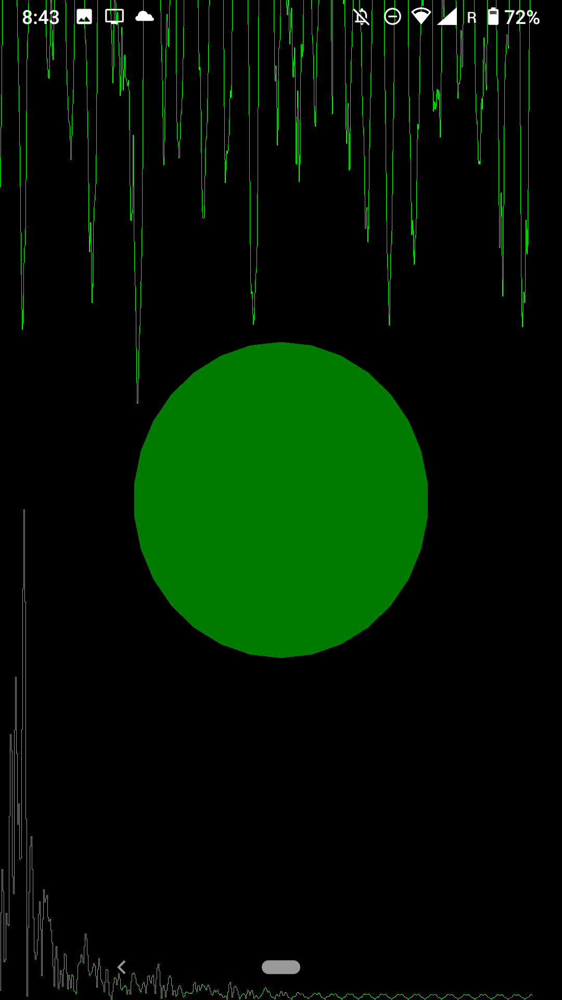

# MUMT-307 project report

## ElectroPARTYogram

### BTrack theory

## Code architecture diagram

## Art generation rules

The art rules are as follows:

 

1. The line at the top half of the screen is the current 1024-sample sized frame of audio signal being processed at the moment the screen is redrawn. The values in the frame are normalized with a running max. The highest peaks of a song will influence the size of the displayed audio wave. Each value after normalization is multiplied by `0.25*screen_height` to create the plot.
2. The line at the bottom half of the screen is the current 1024-sample sized FFT magnitude array created by the OnsetDetectionFunction, normalized and displayed similarly to the above audio signal. It should roughly represent the magnitude of the FFT of the above audio signal
3. The circle in the center has a color and opacity that vary as a function of the current onset value compared to the maximum seen onset. Blue = weak = low onset, red = strong = high onset. A maximal onset will produce a ratio of `current_onset/max_onset = 1.0` and the circle will have the colors `R = 255*1.0, G = 0, B = 255*(1.0-1.0), A = 255*1.0`. A minimal onset will produce a ratio of near 0.0, and the circle will have the colors `R = 0, G = 0, B = 255, A = 0`. In practise, a bright red circle indicates a strong onset, purple are medium, and blueish are dark, hard to see, and represent low-energy portions of the song.
4. Finally, if BTrack predicts that the current frame is a **beat**, then special things happen. Everything turns green and the height factor of audio and FFT plots grows from 0.25 to 0.75 (causing the effect of spiking graphs). The circle still has an opacity that is `255*onset_ratio`. A bright green circle represents a strong onset + predicted beat, and a dim green circle represents a weak onset + predicted beat.

## Optimization

Optimization isn't black magic - here are some basic techniques that should apply to the majority of DSP or MIR algorithms out there:

1. Pre-computed coefficients if possible (Hamming windows, etc.)
2. Pre-allocate arrays if possible (if their size won't grow, etc.)
3. Use r2c FFTs when appropriate, since you're working with real audio data
    1. Pay attention to whether your FFT library supports in-place or requires out-of-place FFTs
    2. Use good libraries (e.g. Ne10 NEON-enabled FFT library in this case)
4. Pass by reference or pointer - or else you may be inadvertently copying big vectors of audio data
5. Favor simple loops (avoid nesting, etc.) to let the compiler help you
