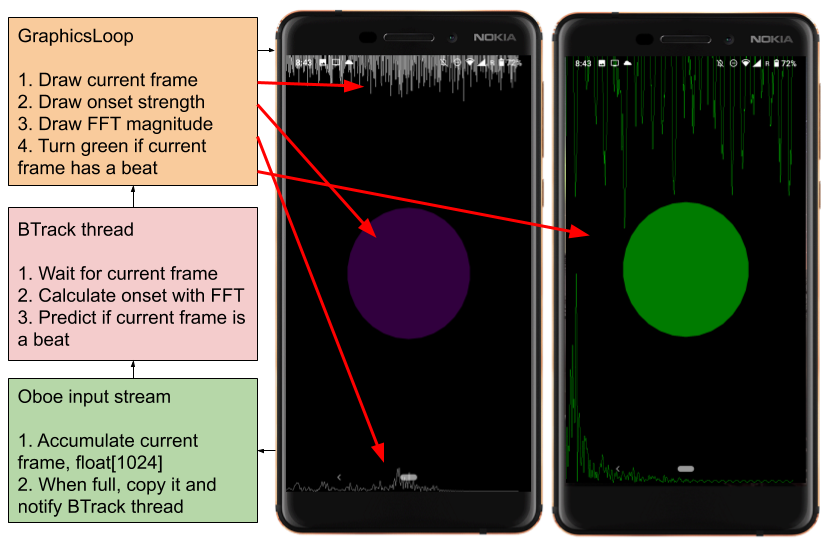
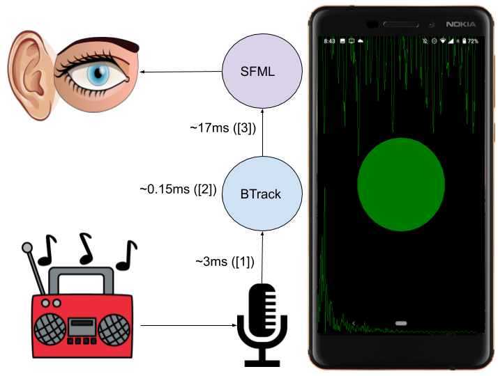
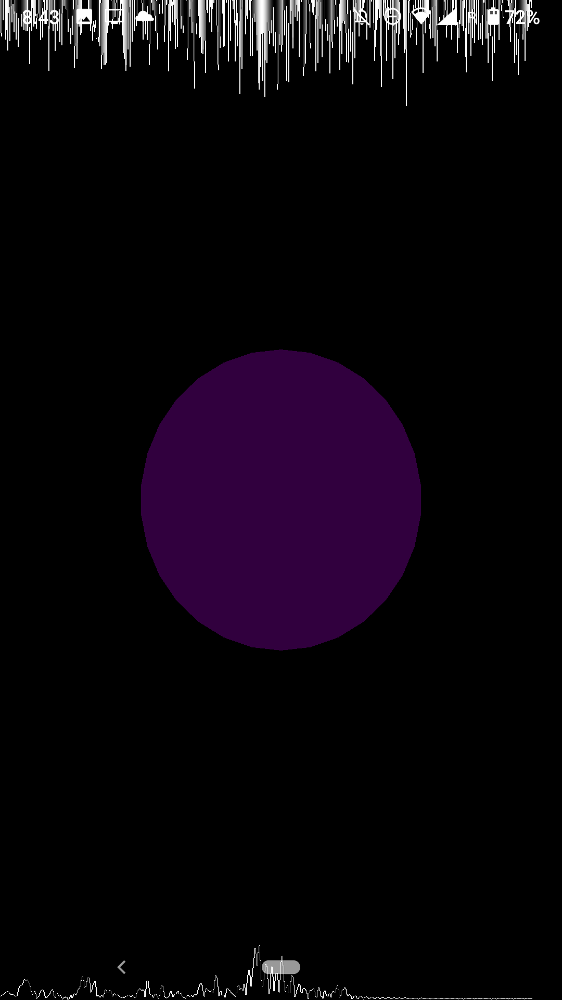
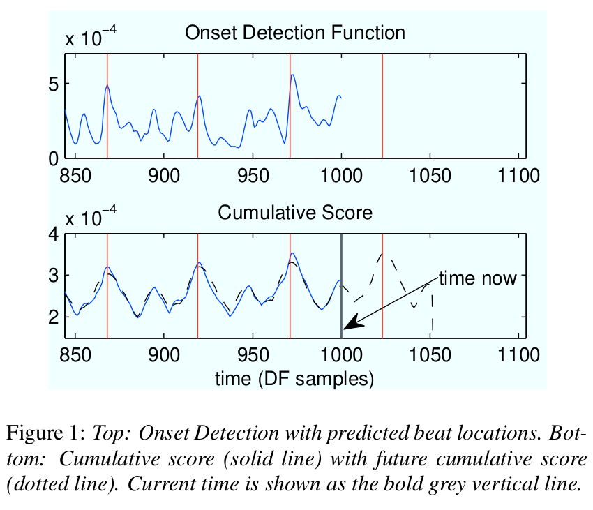
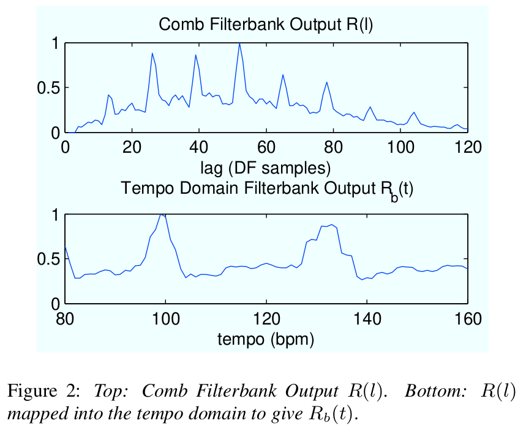

# MUMT-307 project report

### Introduction and motivation

This project arose as the analysis counterpart of my synthesis project for MUMT-306. In [libmetro](https://github.com/sevagh/libmetro), I synthesized metronome tracks with time signatures (3/4, 4:3, etc.) using real-time audio and Stk.

In ElectroPARTYogram, my goal was to analyze the rhythm and beat structure of input audio in real-time and generate some form of visual effects based on the results. I decided to use the [BTrack](https://github.com/adamstark/BTrack) real-time beat tracking algorithm as the core of the app.

#### Try it yourself

If you own an Android phone with an ARM v8 processor (if it's recent it should), you can try to install the signed APK I've released on GitHub: https://github.com/sevagh/ElectroPARTYogram/releases/tag/v0.0

Usage: launch the app, allow it audio recording permissions, put your phone near a source of music, and press the play button.

### Examples

Clips were recorded with the following equipment:
* Nokia 6.1 with Android 10
* Logitech C720 suspended above the phone, recorded using Gnome Cheese on Linux/Fedora laptop with built-in microphone
* Playing music from Spotify web over a Bluetooth speaker

1. [Freeland - We Want Your Soul (Radio Edit)](../example-videos/freeland_we_want_your_soul.webm)
2. [Animals as Leaders - The Woven Web](../example-videos/animals_as_leaders_the_woven_web.webm)
3. [Roni Size, Bahamadia - New Forms](../example-videos/roni_size_new_forms.webm)

### Code architecture diagram



#### Code listing

For grading purposes, the core of the app is written in C++, in the path [`app/src/main/cpp/`](../app/src/main/cpp). One could ignore the surrounding Android ecosystem and get an idea of the implementation of ElectroPARTYogram with standard C++ classes:

```
sevagh:ElectroPARTYogram $ tree -L 1 app/src/main/cpp/
app/src/main/cpp/
|
├── AndroidMain.cpp       <--- "main" for Android - init audio stream and graphics loop
|
├── AudioEngine.cpp       <--- wrapper around Android Oboe real-time audio input
├── AudioEngine.h
├── RecordingCallback.cpp <--- accumulate input audio and notify BTrack
├── RecordingCallback.h
|
├── BTrack.cpp            <--- BTrack algorithm files
├── BTrack.h
├── BTrackPrecomputed.h
├── CircularBuffer.h
├── OnsetDetection.cpp    <--- OnsetDetection is a component of BTrack
├── OnsetDetection.h
├── Window.h              <--- compile-time generated window functions (e.g. tukey, blackman, hamming)
|
├── DrawParams.h          <--- the "art" object shipped by BTrack to draw
├── GraphicsLoop.cpp      <--- SFML graphics loop to render art on screen
├── GraphicsLoop.h
|
├── CMakeLists.txt        <--- Android build system
|
├── logging_macros.h      <--- various boilerplate, third-party code
├── gcem
├── Ne10
├── oboe
├── openal
├── SFML
└── thirdparty-libs
```

### Latency estimation



* [1] Some typical recording latency measurements for Android phones, https://github.com/google/walt/blob/master/docs/AudioLatency.md#sample-measurements
* [2] Measured in the code directly
* [3] Typical 60Hz refresh rate (ElectroPARTYogram enables Vsync with SFML)

### Art generation rules

The art rules are as follows:

 

1. The line at the top half of the screen is the current 1024-sample sized frame of audio signal being processed at the moment the screen is redrawn. The values in the frame are normalized with a running max. The highest peaks of a song will influence the size of the displayed audio wave. Each value after normalization is multiplied by `0.25*screen_height` to create the plot.
2. The line at the bottom half of the screen is the current 1024-sample sized FFT magnitude array created by the OnsetDetectionFunction, normalized and displayed similarly to the above audio signal. It should roughly represent the magnitude of the FFT of the above audio signal
3. The circle in the center has a color and opacity that vary as a function of the current onset value compared to the maximum seen onset. Blue = weak = low onset, red = strong = high onset. A maximal onset will produce a ratio of `current_onset/max_onset = 1.0` and the circle will have the colors `R = 255*1.0, G = 0, B = 255*(1.0-1.0), A = 255*1.0`. A minimal onset will produce a ratio of near 0.0, and the circle will have the colors `R = 0, G = 0, B = 255, A = 0`. In practise, a bright red circle indicates a strong onset, purple are medium, and blueish are dark, hard to see, and represent low-energy portions of the song.
4. Finally, if BTrack predicts that the current frame is a **beat**, then special things happen. Everything turns green and the height factor of audio and FFT plots grows from 0.25 to 0.75 (causing the effect of spiking graphs). The circle still has an opacity that is `255*onset_ratio`. A bright green circle represents a strong onset + predicted beat, and a dim green circle represents a weak onset + predicted beat.

### BTrack theory

Code: https://github.com/adamstark/BTrack

Paper: Real-Time Beat-Synchronous Analysis of Musical Audio, A. M. Stark, M. E. P. Davies and M. D. Plumbley. In Proceedings of the 12th International Conference on Digital Audio Effects (DAFx-09), Como, Italy, September 1-4, 2009.

(My interpretation of) the steps from the paper:

 

1. Detect onsets of the real-time input stream in chunks of 1024 samples ( 1024/48000 = 0.02ms per chunk)
2. Create a cumulative score of onsets with likely _historical_ beat locations
3. Use _momentum_ of the historical cumulative score to try to predict a beat within a single _future_ window
4. Every time a beat is predicted, tempo is recalculated
    1. Autocorrelation is applied to the onsets (this should emphasize periodic onsets)
    2. Pass the autocorrelation function through a "shift-invariant comb filterbank weighted by a tempo preference curve"\*. This should have the effect of picking an "ideal" tempo where the song is most similar to the comb filter
    3. Find the final beat period of the autocorrelation

\*: further description here: https://www.clear.rice.edu/elec301/Projects01/beat_sync/beatalgo.html

#### BTrack optimizations

Here are some basic techniques I used that should apply to many DSP algorithm implementations out there:

1. Pre-compute coefficients if possible (Hamming windows, etc.)
2. Pre-allocate arrays if possible (if their size won't grow, etc.)
3. Use r2c FFTs when appropriate, since you're working with real audio data
    1. Pay attention to whether your FFT library supports in-place or requires out-of-place FFTs
    2. Use good libraries (e.g. Ne10 NEON-enabled FFT library in this case)
4. Pass by reference or pointer - or else you may be inadvertently copying big vectors of audio data
5. Favor simple loops (avoid nesting, etc.) to let the compiler help you
6. Read code carefully to ensure you're not doing redundant computations

Some examples:

| Technique | Original | My code |
|-----------|----------|---------|
| Precompute | https://github.com/adamstark/BTrack/blob/master/src/BTrack.cpp#L123 | https://github.com/sevagh/ElectroPARTYogram/blob/master/app/src/main/cpp/BTrackPrecomputed.h#L137 |
| Preallocate | https://github.com/adamstark/BTrack/blob/master/src/BTrack.cpp#L744 | https://github.com/sevagh/ElectroPARTYogram/blob/master/app/src/main/cpp/BTrack.h#L40 |
| Avoid redundant computations | https://github.com/adamstark/BTrack/blob/master/src/BTrack.cpp#L710, https://github.com/adamstark/BTrack/blob/master/src/BTrack.cpp#L766 | https://github.com/sevagh/ElectroPARTYogram/blob/master/app/src/main/cpp/BTrack.cpp#L108 |
| Don't port parts you don't need | https://github.com/adamstark/BTrack/blob/master/src/BTrack.cpp#L390, https://github.com/adamstark/BTrack/blob/master/src/BTrack.cpp#L269 | https://github.com/sevagh/ElectroPARTYogram/blob/master/app/src/main/cpp/BTrack.cpp#L98 |
| c2c -> r2c FFT | https://github.com/adamstark/BTrack/blob/master/src/BTrack.cpp#L569 | https://github.com/sevagh/ElectroPARTYogram/blob/master/app/src/main/cpp/BTrack.cpp#L267 |
